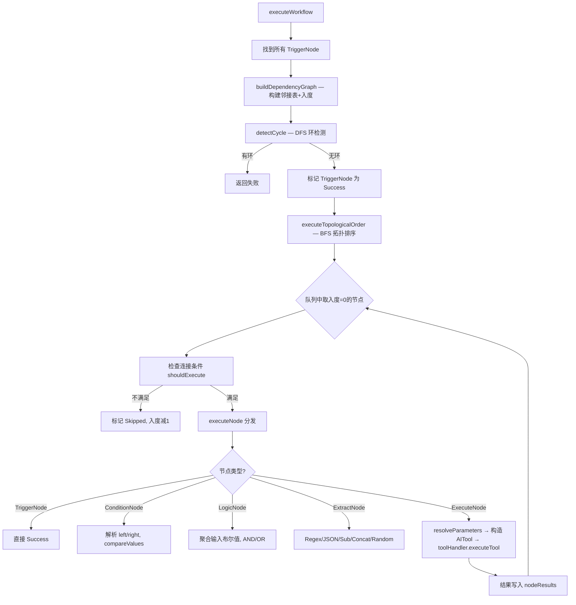

# MetaAgent Workflow 系统深度剖析

## 一、系统总览

作者实现了一个**完整的 DAG（有向无环图）自动化引擎**，涵盖 5 种节点类型 + 拓扑排序执行 + 多触发源 + 定时调度 + 可视化画布编辑器。

**代码量统计**：

| 层 | 文件 | 行数 |
|---|---|---|
| 数据模型 | `Workflow.kt` + `WorkflowExecutionLog.kt` | 226 |
| 执行引擎 | `WorkflowExecutor.kt` | 1171 |
| 调度器 | `WorkflowScheduler.kt` + `WorkflowWorker.kt` | 510 |
| 仓库/持久化 | `WorkflowRepository.kt` | 647 |
| ViewModel | `WorkflowViewModel.kt` | 1426 |
| UI 画布 | `WorkflowDetailScreen.kt` + `WorkflowListScreen.kt` + `GridWorkflowCanvas.kt` | 3000+ |
| Tasker 集成 | `WorkflowTaskerActivity.kt` + `WorkflowTaskerReceiver.kt` | ~200 |
| **合计** | **12+ 文件** | **~7200** |

---

## 二、数据模型设计 (`Workflow.kt`)

### 核心结构

```
Workflow
├── id, name, description, enabled
├── nodes: List<WorkflowNode>      ← 5种节点
├── connections: List<Connection>   ← 有向边（可带条件）
└── 执行统计: totalExecutions, successfulExecutions, lastExecutionStatus
```

### 5 种节点类型

| 节点 | 作用 | 关键字段 |
|------|------|----------|
| **TriggerNode** | 入口触发器 | `triggerType`: manual / schedule / intent / tasker / speech |
| **ExecuteNode** | 执行工具 | `actionType`(工具名) + `actionConfig`(参数Map) + `jsCode`(可选JS) |
| **ConditionNode** | 条件判断 | `left` op `right`, op 支持 EQ/NE/GT/GTE/LT/LTE/CONTAINS/IN 等 10 种 |
| **LogicNode** | 逻辑门 | `AND` / `OR`, 汇聚多个布尔输入 |
| **ExtractNode** | 数据提取/变换 | 支持 REGEX / JSON / SUB(截取) / CONCAT(拼接) / RANDOM_INT / RANDOM_STRING |

### 数据传递机制 — `ParameterValue`

```kotlin
sealed class ParameterValue {
    data class StaticValue(val value: String)        // 静态值
    data class NodeReference(val nodeId: String)      // 引用前序节点输出
}
```

**这是 workflow vs plan tree 最核心的差距**。ExecuteNode 的 `actionConfig` 是 `Map<String, ParameterValue>`，每个参数可以是静态值或引用另一个节点的执行结果。执行器在 `resolveParameterValue()` 中自动解引用：

```kotlin
fun resolveParameterValue(value: ParameterValue, nodeResults: Map<String, NodeExecutionState>): String {
    return when (value) {
        is StaticValue -> value.value
        is NodeReference -> (nodeResults[value.nodeId] as Success).result  // 拿前序节点的输出
    }
}
```
### 连接（边）

```kotlin
data class WorkflowNodeConnection(
    val sourceNodeId: String,
    val targetNodeId: String,
    var condition: String? = null  // 条件标签: "true"/"false"/"error"/"success" 或正则
)
```

`condition` 实现了**条件分支路由**：
- `"true"` / `"false"` → 匹配 ConditionNode/LogicNode 的布尔输出
- `"error"` / `"failed"` → 匹配前序节点失败时走这条边（错误处理分支）
- 正则表达式 → 匹配前序节点输出内容

---

## 三、执行引擎 (`WorkflowExecutor.kt`, 1171 行)

### 执行流程



### 关键算法

**1. 依赖图构建** (`buildDependencyGraph`)
- 两种边来源：显式 `connections` + 隐式 `NodeReference` 引用依赖
- `buildReferenceDependencies()` 扫描所有节点的参数，如果某个 ExecuteNode 的参数引用了另一个节点的输出，自动添加依赖边
- 这意味着即使用户没有画连线，只要参数里引用了前序节点，执行顺序也是正确的

**2. 环检测** (`detectCycle`)
- 标准 DFS 三色标记法（0=未访问, 1=访问中, 2=已完成）
- 发现环直接拒绝执行

**3. 拓扑排序执行** (`executeTopologicalOrder`)
- BFS Kahn 算法：入度为 0 的节点入队 → 执行 → 后继节点入度减 1 → 入度变 0 的入队
- `getReachableNodeIds()` 先正向 BFS 找可达节点，再反向 BFS 找依赖节点，确保只执行与触发路径相关的节点
- 条件路由：执行前检查所有入边的 `condition`，用 `shouldExecute` 逻辑决定是否执行：
  - 空条件 → 前序成功即可
  - `"true"/"false"` → 匹配前序布尔输出
  - `"error"/"failed"` → 匹配前序失败状态
  - 正则 → 匹配前序输出内容

**4. 工具执行** (`executeNode` → ExecuteNode 分支)

```kotlin
// 解析参数（支持静态值和节点引用）
val parameters = resolveParameters(node, nodeResults, triggerExtras)

// 构造 AITool
val tool = AITool(name = node.actionType, parameters = parameters)

// 调用工具处理器执行
val result = toolHandler.executeTool(tool)
```

这里直接复用了 chat 系统的 `AIToolHandler`，意味着 **chat 支持的 119 个工具 workflow 全都能用**。

**5. 错误处理机制**
- 节点失败后，检查是否有 `condition="error"` 的出边
- 如果有且错误处理分支执行成功 → 整体不算失败
- 如果没有错误处理分支 → 整个 workflow 失败

---

## 四、调度系统

### WorkflowScheduler — 三种调度模式

| 模式 | 实现 | 限制 |
|------|------|------|
| **interval** | `PeriodicWorkRequest` | 最小 15 分钟（WorkManager 限制） |
| **specific_time** | `OneTimeWorkRequest` + delay | 一次性执行 |
| **cron** | 简化解析器 → 转换为 WorkManager | 只支持 `*/N * * * *`、`0 */N * * *`、`M H * * *` 三种模式 |

### WorkflowWorker — WorkManager 后台执行

```kotlin
class WorkflowWorker : CoroutineWorker {
    override suspend fun doWork(): Result {
        val repository = WorkflowRepository(applicationContext)
        val result = repository.triggerWorkflow(workflowId, triggerNodeId)
        return if (result.isSuccess) Result.success() else Result.failure()
    }
}
```

App 被杀也能唤醒执行（WorkManager 保证）。

### 5 种触发源

| 触发源 | TriggerNode.triggerType | 说明 |
|--------|------------------------|------|
| 手动 | `manual` | 用户点按钮触发 |
| 定时 | `schedule` | interval/specific_time/cron |
| Intent 广播 | `intent` | 匹配 `triggerConfig["action"]` |
| Tasker 集成 | `tasker` | 匹配 `triggerConfig["command"]` |
| 语音识别 | `speech` | 正则匹配语音文本，带冷却去抖 |

---

## 五、持久化与仓库 (`WorkflowRepository.kt`)

- **存储**：JSON 文件存在 `Download/MetaAgent/workflow/{id}.json`
- **序列化**：`kotlinx.serialization`，带 `classDiscriminator = "__type"` 支持多态节点
- **执行日志**：每次执行保存到 `_execution_logs/{workflowId}/{timestamp}_{runId}.json`，最多保留 30 条
- **变更通知**：`MutableSharedFlow<Unit>` 发事件，ViewModel 收到后重新加载
- **Speech 触发缓存**：2秒 TTL 缓存工作流列表，避免高频语音事件反复读磁盘

---

## 六、UI 层

### WorkflowListScreen (881 行)
- 工作流列表页, 带 FAB Speed Dial 菜单
- 支持多选删除
- **8 种模板一键创建**：对话模板、Intent 广播模板、条件判断模板、逻辑与/或模板、提取计算模板、错误处理分支模板、语音触发模板

### WorkflowDetailScreen (2216 行)
- **GridWorkflowCanvas** — 网格画布，节点可拖拽
- 节点长按弹出操作菜单（编辑/连线/查看日志/删除）
- `NodeDialog` — 节点编辑对话框
  - ExecuteNode 编辑时**自动列出所有可用工具**（从 `AIToolHandler.getAllToolNames()` 读取）
  - 参数编辑支持 StaticValue / NodeReference 切换
  - 支持**工具包导入**（`packageName:toolName` 格式）
- `WorkflowExecutionLogDialog` — 执行日志查看（支持按节点过滤）

---

## 七、我们的 Plan Tree 可以借鉴什么

### 必须借鉴的（能力差距大）

| 特性 | Workflow 有 | Plan Tree 无 | 怎么搬 |
|------|------------|-------------|--------|
| **节点间数据传递** | `ParameterValue.NodeReference` | ❌ | PlanNode 加 `resultSummary`，后续节点 prompt 注入完成节点结果 |
| **通用工具调用** | `ExecuteNode.actionType` → `toolHandler.executeTool()` | adapter 硬编码 3 种 | PlanNode 加 `toolName`/`toolParams`，走通用执行路径 |
| **条件分支** | `ConditionNode` + Connection.condition | ❌ | PlanNode.children 当候选分支，AI 按 confidence 选 |
| **错误处理分支** | `condition="error"` 出边 | 只有粗暴重规划 | 加节点级 fallback，失败时走备选路径 |

### 不需要借鉴的

| 特性 | 原因 |
|------|------|
| 图画布编辑器 | Plan Tree 是 AI 生成的，不需要人手动画图 |
| 定时调度 | Plan Tree 是一次性任务不是重复任务 |
| Tasker/Intent 触发 | Plan Tree 由 chat 对话触发 |
| 静态模板 | Plan Tree 由 LLM 动态生成 |

### Plan Tree 独有的优势（Workflow 没有）

- **AI 动态生成编排** — Workflow 需要人手动配置，Plan Tree 一句话生成
- **实时重规划** — 失败后 AI 重新拆任务，Workflow 只能原路重试
- **用户审批** — 执行前用户可以看到完整计划并修改
- **confidence 权重** — AI 给出信心分，可以选最优路径

---

## 八、代码质量评价

**优点**：
- 拓扑排序执行引擎健壮，环检测 + 可达性分析 + 条件路由都实现了
- `ParameterValue` 的 sealed class 设计优雅
- `buildReferenceDependencies()` 自动推导隐式依赖，用户不需要手动画所有边
- 错误处理设计灵活（支持 on_error 分支而不是一刀切终止）
- 执行日志持久化 + 自动清理 + 节点级过滤

**不足**：
- `WorkflowViewModel.kt` 有 1426 行，大量模板构建代码应该提取到独立 Builder
- `WorkflowDetailScreen.kt` 有 2216 行，高度耦合
- cron 解析器是简化版，只支持 3 种模式
- 没有并行执行（拓扑排序天然支持并行但代码用的串行 BFS）
