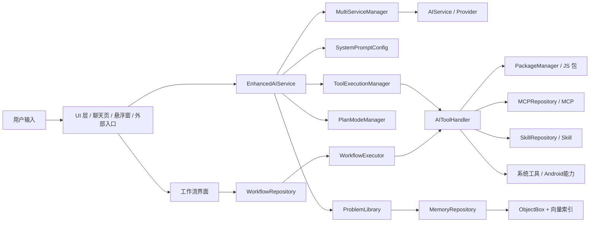

# MetaAgent / Operit 仓库架构完整剖析

## 1. 文档目的

这份文档不是简单“看目录说目录”，而是站在后续要做你们自己项目空壳的角度，完整说明这个仓库：

- 它整体是个什么系统
- 它分成了哪些模块
- 每个模块大概负责什么
- 模块之间怎么交互
- 用了哪些架构思路
- 编译层面涉及哪些子模块、第三方库、原生能力
- 哪些部分值得直接借鉴来搭你们自己的空壳

这份文档对应当前工作区仓库：

- 项目根目录：`D:\SoftInnovationCompetition\Projects\MetaAgent`
- 当前根项目名：`Operit`

需要先说明一个事实：

- 这个仓库已经不是“极简项目模板”，而是一个功能非常重、系统耦合也比较深的 Android AI Agent 平台。
- 所以它更适合被当成“架构参考样板”，而不是直接原样照搬。

---

## 2. 一句话定义这个项目

这个项目本质上是一个运行在 Android 手机上的“AI 智能体操作平台”。

它不是普通聊天应用，而是把下面这些能力整合到了一个工程里：

- 多模型 AI 对话
- 工具调用系统
- JS 包扩展系统
- MCP 插件系统
- Skill 技能系统
- 工作流系统
- 长期记忆系统
- 安卓 UI 自动化
- 虚拟屏 / 多显示器能力
- 本地模型能力
- 文档 / 文件 / 网络 / 系统控制能力

如果用通俗的话讲，这个项目更像：

“一个以聊天入口为外壳、以 AI 调度为中枢、以工具和工作流为手脚、以记忆系统为长期大脑、以 Android 系统权限为执行底座的移动端智能体框架。”

---

## 3. 顶层工程结构

### 3.1 Gradle 多模块结构

根配置在 `settings.gradle.kts` 中声明了以下模块：

- `:app`
- `:dragonbones`
- `:terminal`
- `:mnn`
- `:llama`
- `:showerclient`

其中：

- `app` 是主应用模块，绝大多数业务逻辑都在这里。
- `dragonbones` 是动画相关模块。
- `mnn` 是端侧 MNN 模型支持模块。
- `llama` 是 llama.cpp 相关本地模型支持模块。
- `showerclient` 是虚拟屏 / Shower 客户端模块。
- `terminal` 在当前工作区里没有实际目录，但在 `.gitmodules` 中声明为 Git 子模块，说明编译上依赖外部仓库。

### 3.2 Git 子模块

`.gitmodules` 显示项目依赖以下外部子模块：

- `terminal -> https://github.com/AAswordman/OperitTerminalCore.git`
- `mnn/src/main/cpp/MNN -> https://github.com/alibaba/MNN.git`
- `llama/third_party/llama.cpp -> https://github.com/ggml-org/llama.cpp`
- `tools/hotbuild/OperitNightlyRelease -> 私有仓库`

这说明两个重要事实：

1. 这个项目并不是“纯 Kotlin UI 项目”，它包含原生层和外部 AI 运行时。
2. 当前仓库在本地未必是完全可独立编译的，至少 `terminal` 子模块当前缺失。

---

## 4. 编译与构建层分析

### 4.1 主工程编译特征

`app/build.gradle.kts` 透露出几个很关键的工程特征：

- Android 应用，`compileSdk = 34`
- `minSdk = 26`
- Kotlin + Jetpack Compose
- 使用 AIDL
- 启用了 CMake 原生编译
- Java / Kotlin 目标版本为 17
- 使用 ObjectBox 插件
- 使用 Room
- 只编译 `arm64-v8a`

这说明它的构建不是“纯 Java/Kotlin 层”，而是：

- `Kotlin/Compose UI`
- `Android 系统服务与组件`
- `JNI/C++`
- `本地模型库`
- `脚本扩展层`

### 4.2 原生构建

`app/src/main/cpp/CMakeLists.txt` 编译了一个叫 `streamnative` 的动态库，包含：

- XML 流拆分
- Markdown 流拆分
- JSON 流解析插件
- Plan 执行流插件
- 热流处理

这说明项目在“流式输出解析”上做了 native 优化，不完全依赖 Kotlin 字符串处理。

### 4.3 模块级构建定位

#### `app`

主业务模块，包含：

- UI
- AI 会话
- 工具系统
- 工作流
- 记忆系统
- Android 集成

#### `dragonbones`

单独 Android library，使用 Compose，外加 native build，定位偏向：

- 角色动画
- 表情 / 看板娘 / 动态形象展示

#### `mnn`

单独 Android library，带 CMake 原生编译，明显用于：

- MNN 本地模型推理
- 端侧 LLM 支持

构建参数里明确打开了：

- `MNN_BUILD_LLM=ON`
- Transformer fuse
- ARM 8.2
- 低内存模式

所以这是一个典型“端侧 LLM 推理支持模块”。

#### `llama`

单独 Android library，面向 llama.cpp，本地工作区里看起来还是偏 stub / 接线阶段，但结构上已经为：

- llama.cpp 接入
- 本地 GGUF / llama 系模型支持

预留了编译入口。

#### `showerclient`

单独 Android library，开启了 AIDL，不用 Compose，定位是：

- Binder / IPC
- 虚拟屏交互
- Shower 服务通信

这个模块更像是“系统通信底座”。

#### `terminal`

被声明为模块，但当前目录缺失。根据命名与子模块来源，定位大概率是：

- 终端核心
- Shell 执行能力
- 类 Linux / Termux 交互底座

对你们以后做空壳参考时，这一项要特别注意：

- 如果照抄 Gradle 结构，不能忘记 `terminal` 是外部依赖，不是本仓库自带完整实现。

---

## 5. 主模块 `app` 的总体分层

`app/src/main/java/com/ai/assistance/operit` 下一级目录如下：

- `api`
- `core`
- `data`
- `integrations`
- `provider`
- `services`
- `ui`
- `util`
- `widget`

这套分层是比较标准、而且很适合抄空壳的。

可以把它理解为：

| 层 | 作用 |
|---|---|
| `ui` | 界面与交互入口 |
| `api` | AI 对话与运行时编排 |
| `core` | 核心能力、工具系统、工作流、Agent 能力 |
| `data` | 数据模型、数据库、仓库、配置、持久化 |
| `services` | 后台服务、前台服务、常驻能力 |
| `integrations` | 对外集成，比如 Intent、Tasker |
| `provider` | DocumentsProvider 等系统级数据暴露 |
| `util` | 通用工具库 |
| `widget` | 小组件 |

---

## 6. 启动层：应用是怎么拉起来的

核心入口是：

- `app/src/main/java/com/ai/assistance/operit/core/application/OperitApplication.kt`
- `app/src/main/java/com/ai/assistance/operit/ui/main/MainActivity.kt`

### 6.1 `OperitApplication` 负责什么

它负责应用级初始化，典型内容包括：

- WorkManager 初始化
- Activity 生命周期追踪初始化
- AIMessageManager 初始化
- 启动全局 AI 前台服务
- 异步初始化 ONNX Embedding 服务
- 设置全局异常处理器
- 配置全局 JSON 序列化
- 初始化语言环境
- 初始化用户偏好与权限偏好
- 初始化角色卡管理器
- 初始化自定义表情库
- 初始化 Android Shell 执行上下文
- 初始化 Shower 虚拟屏环境
- 初始化 PDFBox
- 初始化编辑器语言支持
- 初始化 TextSegmenter
- 初始化图片池 / 媒体池 / Skill 压缩包池

所以它在架构上的角色很明确：

- 它不是业务层。
- 它是“基础设施总装配层”。

### 6.2 `MainActivity` 负责什么

`MainActivity` 做的事情明显比普通主界面 Activity 多很多：

- 处理启动 Intent
- 处理 GitHub OAuth 回调
- 处理文件和链接分享
- 初始化工具系统
- 初始化更新管理器
- 初始化 MCP 插件加载流程
- 权限引导
- 数据迁移引导
- 设置 Compose 主界面

所以这里的设计思路是：

- `Application` 负责系统初始化
- `MainActivity` 负责“进入应用后的首轮业务检查与路由”

这种拆法很适合你们以后做空壳。

---

## 7. UI 层：它不是一个聊天页，而是一整套界面系统

UI 结构主要集中在：

- `ui/main`
- `ui/features`
- `ui/common`
- `ui/components`
- `ui/theme`
- `ui/permissions`
- `ui/floating`

### 7.1 `ui/features` 下有哪些业务模块

一级功能页面包括：

- `about`
- `agreement`
- `announcement`
- `assistant`
- `chat`
- `demo`
- `help`
- `memory`
- `migration`
- `packages`
- `permission`
- `settings`
- `startup`
- `token`
- `toolbox`
- `update`
- `workflow`

这说明 UI 设计思想非常明确：

- 聊天只是其中一个功能页
- 系统本身还有大量“配置、扩展、管理、调试、自动化”页面

### 7.2 `OperitScreens` 的角色

`ui/main/screens/OperitScreens.kt` 相当于统一屏幕路由配置中心。

里面集中管理了：

- 聊天页
- 记忆页
- 包管理页
- MCP 市场 / 管理 / 发布
- Skill 市场 / 管理 / 发布 / 详情
- 工作流页
- 工具箱
- 设置相关页

所以从架构角度看，这个项目的 UI 不是“单页应用”，而是一个模块化后台式移动应用。

---

## 8. AI 运行时层：项目真正的“大脑”

这一层集中在：

- `api/chat`
- `api/chat/enhance`
- `api/chat/library`
- `api/chat/plan`
- `api/chat/llmprovider`

### 8.1 `EnhancedAIService` 是总控大脑

核心文件：

- `app/src/main/java/com/ai/assistance/operit/api/chat/EnhancedAIService.kt`

这个类是全项目最重要的运行时中枢之一，主要负责：

- 管理聊天实例
- 组织历史上下文
- 选择对应功能类型的 AI 服务
- 管理工具调用
- 管理多轮对话
- 管理文件绑定
- 管理输入处理状态
- 连接包系统、工具系统、记忆系统

如果用一句话总结：

- `EnhancedAIService` 就是“用户输入进入 AI 系统后的总调度器”。

### 8.2 `enhance` 子包负责什么

`api/chat/enhance` 里包含：

- `ConversationMarkupManager`
- `ConversationRoundManager`
- `ConversationService`
- `FileBindingService`
- `InputProcessor`
- `MultiServiceManager`
- `ReferenceManager`
- `ToolExecutionManager`

它们合在一起构成了“增强型对话运行时”。

可以这样理解：

- `Conversation*` 负责对话轮次、格式、内容组织
- `InputProcessor` 负责输入预处理
- `ReferenceManager` 负责引用资料管理
- `ToolExecutionManager` 负责从 AI 输出中提取工具调用并执行
- `FileBindingService` 负责 AI 生成代码与现有文件做结构化融合
- `MultiServiceManager` 负责不同功能类型使用不同模型服务

### 8.3 `FunctionType` 体现了多 AI 通道架构

`data/model/FunctionType.kt` 里定义了：

- `CHAT`
- `SUMMARY`
- `PROBLEM_LIBRARY`
- `UI_CONTROLLER`
- `TRANSLATION`
- `GREP`
- `IMAGE_RECOGNITION`
- `AUDIO_RECOGNITION`
- `VIDEO_RECOGNITION`

这说明它的设计不是：

- “一个模型负责所有任务”

而是：

- “不同任务类型使用不同 AI 通道和配置”

这是一种很值得参考的架构设计，因为它天然支持：

- 多模型协同
- 不同任务的成本控制
- 不同任务的能力差异化配置

### 8.4 `MultiServiceManager` 的作用

核心文件：

- `api/chat/enhance/MultiServiceManager.kt`

它负责：

- 根据 `FunctionType` 找到对应配置
- 从配置创建 AIService
- 缓存不同功能的 service 实例
- 刷新和释放服务
- 管理不同功能的 token 计数

这相当于“模型服务工厂 + 实例池 + 路由层”。

### 8.5 `llmprovider`：支持哪些模型/供应商

`api/chat/llmprovider` 里能看到：

- `OpenAIProvider`
- `ClaudeProvider`
- `GeminiProvider`
- `QwenAIProvider`
- `DeepseekProvider`
- `DoubaoAIProvider`
- `MistralProvider`
- `MNNProvider`
- `LlamaProvider`

这说明它支持：

- 云端模型供应商
- 本地模型供应商

也就是典型的“云边混合模型架构”。

### 8.6 `plan`：计划模式 / 深度搜索模式

`api/chat/plan` 包括：

- `PlanModels`
- `PlanModeManager`
- `PlanParser`
- `TaskExecutor`

`PlanModeManager` 的思路是：

- 先让 AI 把复杂任务拆成多个子任务
- 形成执行图
- 并行 / 顺序执行子任务
- 最后汇总结果

所以这个项目里其实已经有一个“轻量级元调度 / 规划模式”的雏形。

它不等于你们产品书里的完整元智能体系统，但架构思路已经很接近。

### 8.7 `library`：问题库 / 记忆结构化入口

这里有：

- `ProblemLibrary.kt`
- `ProblemLibraryTool.kt`

作用是：

- 把对话抽取成知识点
- 把内容归档到问题库和记忆库
- 对未分类记忆自动归类

这个模块本质上是“聊天内容到结构化知识”的桥梁。

---

## 9. Prompt 系统：项目是如何动态控制 AI 的

核心文件：

- `core/config/SystemPromptConfig.kt`

这个模块非常关键，因为它说明系统不是写死一个 prompt，而是动态拼装。

它会把这些内容组装进系统提示里：

- 行为规范
- 工具使用规范
- 包系统规范
- 当前激活的包
- 当前可用工具
- 中英文版本差异
- 子任务代理模式提示

这意味着项目采用的是一种：

- “Prompt 配置中心化”
- “Prompt 和运行时能力联动”

的架构。

这类设计对于空壳非常值得借鉴，因为它能把：

- AI 行为规则
- 工具暴露规则
- 模块扩展规则

统一收口到一个地方管理。

---

## 10. 工具系统：AI 的执行层

核心目录：

- `core/tools`

其中包括：

- `agent`
- `calculator`
- `condition`
- `defaultTool`
- `javascript`
- `mcp`
- `packTool`
- `skill`
- `system`

### 10.1 `AIToolHandler` 的作用

核心文件：

- `core/tools/AIToolHandler.kt`

它负责：

- 注册工具
- 管理工具执行器
- 检查权限
- 自动补注册默认工具
- 工具调用执行
- 与包系统联动

一句话概括：

- 它是整个项目工具体系的“总线和注册中心”。

### 10.2 `ToolExecutionManager` 的作用

核心文件：

- `api/chat/enhance/ToolExecutionManager.kt`

它负责：

- 从 AI 输出中提取 `<tool>` 调用
- 校验参数
- 检查权限
- 并行/串行执行工具
- 聚合工具结果

所以工具执行链路是这样的：

1. AI 输出工具调用
2. `ToolExecutionManager` 解析调用
3. `AIToolHandler` 找到工具执行器
4. 权限系统检查
5. 执行器真正调用 Android / JS / MCP / 系统能力
6. 结果回流给 AI

### 10.3 `defaultTool` 是默认原生工具集

虽然这里没有逐个展开源码，但从整体结构和资产包可以确定它承载的是：

- 文件读写
- 网络访问
- 系统操作
- 聊天管理
- 权限管理
- 基础自动化

也就是“不开插件也能使用的内建工具集”。

### 10.4 `javascript`：JS 扩展引擎

核心文件：

- `core/tools/javascript/JsEngine.kt`

它的架构很有意思：

- 用 WebView 作为 JS 运行引擎
- 通过 `JavascriptInterface` 暴露原生工具调用能力
- 支持 JS 脚本调用 Android 原生工具
- 支持中间结果和最终结果回传

也就是说，项目不是简单“加载 JS 文件”，而是做了一个：

- “JS 运行时 + 原生桥接层”

这使得很多工具可以不用重新写 Kotlin，而是用 JS 包快速扩展。

### 10.5 `packTool`：包系统

核心文件：

- `core/tools/packTool/PackageManager.kt`

它负责：

- 从 assets 加载内置 JS 包
- 从外部存储加载扩展包
- 自动导入默认包
- 管理可用包 / 已导入包 / 已激活包
- 按需激活包
- 把包里的工具注册进工具系统

这个模块非常适合借鉴，因为它实现了：

- “平台核心尽量轻，能力通过包扩展”

这正是做空壳时很需要的设计。

### 10.6 资产包里有哪些内置能力

`app/src/main/assets/packages` 下可见的内置包包括：

- `automatic_ui_base.js`
- `automatic_ui_subagent.js`
- `code_runner.js`
- `crossref.js`
- `daily_life.js`
- `duckduckgo.js`
- `extended_file_tools.js`
- `extended_http_tools.js`
- `extended_memory_tools.js`
- `ffmpeg.js`
- `file_converter.js`
- `github.js`
- `google_search.js`
- `history_chat.js`
- `super_admin.js`
- `system_tools.js`
- `tasker.js`
- `tavily.js`
- `time.js`
- `various_output.js`
- `various_search.js`
- `workflow.js`
- 若干绘图包

这些包大致可以分成几类：

- 搜索类
- 文件处理类
- 系统控制类
- 自动化类
- 工作流类
- 绘图类
- 记忆增强类

### 10.7 `mcp`：MCP 插件桥接层

相关模块包括：

- `core/tools/mcp`
- `data/mcp/MCPRepository.kt`

`MCPRepository` 主要负责：

- 安装 / 卸载 MCP 插件
- 扫描本地插件
- 管理远程 MCP 服务
- 判断命令型插件是否需要物理安装
- 向 UI 暴露 MCP 状态

这说明它做的不是“只会调用 MCP”，而是连：

- 市场
- 安装态
- 本地目录
- 远程连接

都纳入统一管理。

### 10.8 `skill`：技能系统

相关模块：

- `core/tools/skill/SkillManager.kt`
- `data/skill/SkillRepository.kt`

这个系统基于 `SKILL.md` 文件组织技能，支持：

- 扫描本地 skill 目录
- 读取技能描述
- 从 zip 导入技能
- 从 GitHub 仓库导入技能
- 控制技能是否对 AI 可见

它的本质更接近：

- “结构化 Prompt 包 / 技能说明包”

而不是自动学习引擎。

这一点要分清：

- 它支持技能管理与导入
- 但它不等于“从用户行为自动学出技能”

---

## 11. 工作流系统：让能力可编排

核心目录：

- `core/workflow`
- `data/repository/WorkflowRepository.kt`
- `data/model/Workflow.kt`

### 11.1 工作流模型

`Workflow.kt` 中可以看到它有多种节点：

- `TriggerNode`
- `ExecuteNode`
- `ConditionNode`
- `LogicNode`
- `ExtractNode`

所以它不是简单“顺序执行脚本”，而是一个图结构工作流。

### 11.2 `WorkflowExecutor`

职责包括：

- 构建依赖图
- 检测环
- 解析参数引用
- 执行条件判断
- 执行逻辑节点
- 执行提取节点
- 执行工具节点

这说明项目采用的是：

- “图执行器”而不是“线性脚本解释器”

### 11.3 `WorkflowRepository`

职责包括：

- 将工作流存为 JSON 文件
- 从 `Downloads/Operit/workflow` 读写工作流
- 触发工作流
- 更新执行状态
- 维护调度
- 处理语音触发缓存

### 11.4 `WorkflowScheduler`

职责包括：

- 定时调度
- 与 WorkManager 协同

所以这个工作流系统已经形成了完整闭环：

- 定义
- 存储
- 调度
- 执行
- 状态更新

这对你们做空壳很重要，因为后面很多需求都可以先走工作流，不用一开始就写死业务逻辑。

---

## 12. 记忆系统：这个项目的长期大脑

核心模块：

- `data/repository/MemoryRepository.kt`
- `api/chat/library/ProblemLibrary.kt`
- `data/model/Memory.kt`
- `data/model/DocumentChunk.kt`

### 12.1 `MemoryRepository` 负责什么

它负责：

- 记忆的增删改查
- 文档切块
- Embedding 生成
- 向量索引构建
- 相似检索
- 记忆关系图构建
- 导入导出

这里最重要的一点是：

- 它不是单纯保存聊天记录
- 它是在保存“可检索知识单元”

### 12.2 底层存储架构

这个项目同时用了两套存储：

#### Room

用于：

- ChatEntity
- MessageEntity
- ProblemEntity

也就是更偏传统关系数据：

- 聊天会话
- 消息
- 问题记录

#### ObjectBox

用于：

- Memory
- Tag
- Link
- Chunk
- Embedding

也就是更偏：

- 记忆图谱
- 向量检索
- 半结构化知识

这是一个很典型的“双存储分层”设计：

- 关系型结构化数据用 Room
- 高性能对象/图谱/向量数据用 ObjectBox

### 12.3 向量检索与 Embedding

`MemoryRepository` 使用了：

- `OnnxEmbeddingService`
- `VectorIndexManager`
- HNSW 索引

`OnnxEmbeddingService.kt` 使用 ONNX Runtime 加载多语言 embedding 模型：

- `paraphrase-multilingual-MiniLM-L12-v2`
- 输出维度 384

这说明记忆系统支持：

- 多语言语义向量化
- 语义检索
- 文档块级检索

### 12.4 `ProblemLibrary` 的作用

它更像“记忆加工厂”，负责把聊天内容加工成：

- 记忆点
- 关系
- 标签
- 分类结果

所以完整链路是：

1. 用户聊天
2. AI 对话结束
3. 重要信息进入 ProblemLibrary
4. ProblemLibrary 生成结构化记忆
5. MemoryRepository 保存并建立向量索引与关系图

---

## 13. UI Agent / 安卓自动化系统

核心模块：

- `core/tools/agent/PhoneAgent.kt`
- `core/tools/agent/ShowerController.kt`

### 13.1 `PhoneAgent`

这是一个非常有代表性的模块，定位是：

- AI 驱动的手机界面操作代理

它负责：

- 分析当前界面
- 决定下一步动作
- 执行点击、滑动、按键等操作
- 处理虚拟屏依赖
- 处理权限检查
- 管理多步执行过程

### 13.2 虚拟屏 / Shower

项目通过 Shower 体系支持：

- 创建虚拟显示
- 在虚拟屏上执行自动化
- 叠加显示进度
- 多 agent 会话隔离

所以这层架构可以理解成：

- AI 的“手”和“眼”

如果没有这一层，AI 只能聊天和调工具；
有了这一层，它可以“直接操作界面”。

---

## 14. Service 层：后台能力如何维持

`services` 目录下可见：

- `ChatServiceCore.kt`
- `EmbeddingService.kt`
- `FloatingChatService.kt`
- `OnnxEmbeddingService.kt`
- `TermuxCommandResultService.kt`
- `UIDebuggerService.kt`
- 以及子目录 `assistant`、`core`、`floating`、`notification`

### 14.1 `AIForegroundService`

虽然类位于 `api/chat`，但角色本质上是核心服务层。

它负责：

- 前台保活
- 通知渠道
- 唤醒词监听
- 外部录音冲突检测
- 工作流语音触发
- 回复通知

这是“应用长时间运行时的守护层”。

### 14.2 `FloatingChatService`

用于：

- 悬浮聊天窗口
- 脱离主界面的会话入口

### 14.3 `UIDebuggerService`

用于：

- UI 调试和相关前台能力

### 14.4 `OnnxEmbeddingService`

用于：

- 本地 embedding 生成
- 初始化模型与 tokenizer
- 给记忆库提供语义向量能力

---

## 15. 数据层：仓库、偏好、模型、更新等

`data` 下面主要包含：

- `api`
- `backup`
- `converter`
- `dao`
- `db`
- `exporter`
- `mcp`
- `migration`
- `mnn`
- `model`
- `preferences`
- `repository`
- `skill`
- `updates`

### 15.1 `model`

这一层定义核心数据结构，比如：

- `AITool`
- `ToolPrompt`
- `FunctionType`
- `ModelConfigData`
- `ChatEntity`
- `ChatHistory`
- `ChatMessage`
- `Memory`
- `DocumentChunk`
- `Workflow`
- `CharacterCard`

也就是说：

- `model` 是业务语义模型层。

### 15.2 `preferences`

这一层是配置中心，典型包括：

- `ApiPreferences`
- `ModelConfigManager`
- `FunctionalConfigManager`
- `DisplayPreferencesManager`
- `SpeechServicesPreferences`
- `WakeWordPreferences`
- `UserPreferencesManager`
- `CharacterCardManager`
- `SkillVisibilityPreferences`

说明项目大量依赖“偏好配置驱动行为”，而不是把行为写死在代码里。

### 15.3 `repository`

典型仓库包括：

- `ChatHistoryManager`
- `CustomEmojiRepository`
- `MemoryRepository`
- `UIHierarchyManager`
- `WorkflowRepository`

这一层负责统一封装数据来源，隔离 UI 与底层实现。

### 15.4 `updates`

这层负责：

- 更新检查
- 补丁安装

说明项目除了核心业务，还考虑了发布和升级链路。

### 15.5 `migration`

这层负责：

- 旧数据迁移
- 历史结构兼容

这说明项目已经运行迭代过一段时间，不是一次性 demo。

---

## 16. Integrations：对外集成能力

目录：

- `integrations/intent`
- `integrations/tasker`

### 16.1 Intent 集成

`ExternalChatReceiver.kt` 支持：

- 外部应用通过广播触发聊天
- 传入 message
- 指定 chat/group
- 选择是否启动悬浮窗
- 接收结果广播回传

说明项目具备：

- “被其他 App 当作 AI 能力底座调用”的能力

### 16.2 Tasker 集成

可见文件：

- `AIAgentTasker.kt`
- `WorkflowTaskerActivity.kt`
- `WorkflowTaskerReceiver.kt`

这说明它打通了 Tasker 自动化生态，支持：

- Tasker 触发 AI 任务
- Tasker 触发工作流

这部分是典型“外部自动化生态集成层”。

---

## 17. Provider：把内部数据暴露给 Android 系统

目录中有：

- `WorkspaceDocumentsProvider.kt`
- `MemoryDocumentsProvider.kt`

### 17.1 WorkspaceDocumentsProvider

它把应用私有目录下的 workspace 暴露为 DocumentsProvider，便于：

- 通过系统文件选择器访问
- 支持 SAF
- 让文件系统工具更像“系统级文件提供者”

### 17.2 MemoryDocumentsProvider

从命名和配套声明看，它用于：

- 让记忆相关内容通过文档提供者对外可见 / 可访问

这类 Provider 设计说明项目不是封闭 App，而是试图和 Android 文档体系融合。

---

## 18. Widget：小组件入口

Manifest 中声明了：

- `VoiceAssistantWidgetReceiver`

说明项目支持：

- 桌面语音助手小组件

也就是它把 AI 入口做到了桌面层，而不只是 App 内。

---

## 19. Manifest 体现出的系统级能力

`AndroidManifest.xml` 透露了项目的系统集成深度。

### 19.1 权限范围

它申请了大量权限，包括：

- 网络
- 前台服务
- 媒体投屏
- 外部存储
- 安装包
- 悬浮窗
- 写设置
- 通知
- 麦克风
- 电话
- 短信
- 位置
- 电池优化白名单
- 唤醒锁
- 开机启动
- 精确定时
- 查询全部包

这意味着它在系统能力上追求的是：

- “尽量完整的智能助理权限集合”

### 19.2 注册的核心组件

Manifest 中注册了：

- `MainActivity`
- `CrashReportActivity`
- `AIForegroundService`
- `FloatingChatService`
- `ScreenCaptureService`
- `UIDebuggerService`
- `OperitNotificationListenerService`
- `WorkspaceDocumentsProvider`
- `MemoryDocumentsProvider`
- `ExternalChatReceiver`
- Tasker 集成 Activity / Receiver

这说明它的 Android 组件架构已经非常完整：

- Activity
- Service
- Receiver
- Provider

四类核心组件都用了。

---

## 20. 第三方依赖完整分类说明

下面按用途而不是按字母顺序整理，这样更适合你们做空壳参考。

### 20.1 Android / Kotlin / Compose 基础

- Android Gradle Plugin
- Kotlin
- Kotlin Serialization
- AndroidX Core KTX
- AppCompat
- Material / Material3
- Activity Compose
- Lifecycle Runtime KTX
- Navigation Compose
- Window / Material3 Window Size Class
- WorkManager
- DataStore
- Glance

用途：

- App 基础框架
- Compose UI
- 导航
- 生命周期
- 定时任务
- 配置存储
- 小组件

### 20.2 数据库与持久化

- Room
- ObjectBox
- Gson
- kotlinx-serialization
- HJSON
- UUID

用途：

- 聊天与结构化数据持久化
- 记忆对象库与图谱
- JSON / HJSON 配置解析

### 20.3 网络与模型供应商对接

- OkHttp
- OkHttp SSE
- Jsoup
- MCP Kotlin SDK

用途：

- HTTP 请求
- 流式返回
- 网页抓取
- MCP 协议接入

### 20.4 AI / NLP / 本地模型

- ONNX Runtime Android
- TensorFlow Lite
- MediaPipe Tasks Text
- Jieba
- HNSWLib
- `:mnn`
- `:llama`

用途：

- 语义向量
- 本地 NLP
- 本地模型推理
- 中文分词
- 向量检索

### 20.5 图像 / 媒体 / OCR / 文档

- ML Kit Text Recognition
- ZXing
- Glide
- Coil / Coil Compose
- AndroidSVG
- android-gif-drawable
- Image Cropper
- ExoPlayer
- iTextG
- PDFBox Android
- Zip4j
- Apache POI
- Commons Compress
- Commons IO
- Junrar
- ffmpegkit.jar

用途：

- OCR
- 二维码
- 图片加载
- SVG / GIF 支持
- 视频播放
- PDF / Office 文档处理
- 压缩包处理
- 多媒体处理

### 20.6 UI 与交互增强

- ColorPicker Compose
- Reorderable
- Swipe
- RenderX
- JLatexMath
- DragonBones 模块

用途：

- 颜色选择
- 列表拖拽排序
- 滑动操作
- LaTeX 渲染
- 动态角色表现

### 20.7 系统级能力 / 安卓高级集成

- libsu
- Shizuku API / Provider
- Tasker Plugin Library
- NanoHTTPD
- AIDL
- DocumentsProvider

用途：

- root / shell
- adb / Shizuku 权限桥接
- Tasker 自动化集成
- 本地 Web 服务
- 进程通信
- 系统文件访问集成

### 20.8 APK / 包处理相关

- apksig
- apk-parser
- axml
- zipalign-java
- arsc.jar

用途：

- APK 解析
- AndroidManifest / AXML 处理
- 重签名 / 对齐

### 20.9 日志与测试

- kotlin-logging
- slf4j
- JUnit
- AndroidX Test
- Espresso
- Mockito
- Coroutines Test

用途：

- 日志
- 单测 / 仪器测试
- Mock

---

## 21. JS / 工具链相关的非 Android 构建

根目录有 `package.json`，使用的前端 / Node 工具链比较轻，主要包括：

- `typescript`
- `esbuild`
- `copy-paste`
- `object-sizeof`

脚本包括：

- `build`
- `java2ts`
- `builder`
- `build:examples:github`

说明这个仓库除了 Android 编译，还存在：

- JS 包构建
- 示例包构建
- Java 到 TS 的辅助流程

这部分说明项目的“包生态”不是临时拼出来的，而是有独立构建链的。

---

## 22. Native / 脚本 / 外部工具目录

根目录 `tools` 下可以看到：

- `desktop`
- `github`
- `hotbuild`
- `mcp_bridge`
- `shell_identity_launcher`
- `shower`
- `string`
- 多个 bat / sh / py 脚本

这些内容说明仓库不只是 App 本体，还带有：

- 虚拟屏服务器辅助脚本
- Hot build / 夜版发布辅助工具
- MCP 桥接工具
- 字符串 / 资源处理工具
- 外部桌面支持脚本

所以它是一个“完整工程生态”，不是只有 `app/` 一个目录。

---

## 23. 这个项目采用了哪些架构思路

综合代码来看，至少采用了以下架构思想。

### 23.1 分层架构

表现为：

- UI 层
- 服务层
- 核心能力层
- 数据层
- 集成层

优点：

- 容易拆空壳
- 易于按功能逐步扩展

### 23.2 仓库模式

表现为：

- `MemoryRepository`
- `WorkflowRepository`
- `CustomEmojiRepository`
- `SkillRepository`

优点：

- 隔离底层存储实现
- UI 不直接绑数据库

### 23.3 多服务路由架构

表现为：

- `FunctionType`
- `MultiServiceManager`

优点：

- 不同任务绑定不同模型
- 本地模型和云模型可以并存

### 23.4 插件化 / 包化架构

表现为：

- `PackageManager`
- JS 包
- MCP 包
- Skill 包

优点：

- 核心功能不必全部写死
- 非核心功能能后装

### 23.5 图式工作流架构

表现为：

- `Workflow`
- `WorkflowExecutor`

优点：

- 适合把自动化逻辑配置化
- 很适合作为空壳之后的功能扩展点

### 23.6 双存储架构

表现为：

- Room 管聊天
- ObjectBox 管记忆与图谱

优点：

- 按数据特性选择合适存储

### 23.7 Native + Kotlin 混合架构

表现为：

- CMake
- `streamnative`
- MNN
- llama.cpp

优点：

- 把高性能部分放到原生层
- 本地模型能力更强

### 23.8 Android 系统深度集成架构

表现为：

- Service
- Provider
- Receiver
- SAF
- Notification Listener
- 悬浮窗
- Shizuku / libsu

优点：

- 真正能做“智能助手”
- 不只是对话

---

## 24. 模块交互总链路

最核心的交互链可以概括为：

### 24.1 普通聊天链路

1. 用户在聊天页输入问题
2. UI 把消息交给 `EnhancedAIService`
3. `EnhancedAIService` 组织上下文与 prompt
4. `MultiServiceManager` 选定对应 AI provider
5. AI 返回文本，若包含工具调用则进入 `ToolExecutionManager`
6. 工具结果回流给 AI
7. AI 输出最终答复
8. 有价值信息再进入 `ProblemLibrary` 和 `MemoryRepository`

### 24.2 工作流链路

1. 用户在工作流界面定义流程
2. `WorkflowRepository` 存储为 JSON
3. `WorkflowScheduler` 定时触发，或用户主动触发
4. `WorkflowExecutor` 解析节点图
5. `ExecuteNode` 通过 `AIToolHandler` 调工具
6. 返回执行状态并更新统计

### 24.3 自动化 Agent 链路

1. 用户提出 UI 自动化需求
2. AI 切换到 `UI_CONTROLLER` 类型或子代理包
3. `PhoneAgent` 读取屏幕、规划步骤
4. `ShowerController` / 系统工具执行点击滑动等操作
5. 中间结果继续反馈给 AI

### 24.4 外部集成链路

1. 外部应用或 Tasker 发送 Intent / 事件
2. Receiver 接收后调用聊天工具或工作流
3. 结果再通过广播或通知返回

---

## 25. 如果要“抄空壳”，最值得抄哪些部分

不建议原样照搬全部功能。最值得抄的是骨架，不是重量级实现。

### 25.1 最值得直接借鉴的骨架

1. 顶层目录分层
   `ui / api / core / data / services / integrations / provider / util`

2. `EnhancedAIService` 这种总控入口
   即使初期只支持普通聊天，也建议保留这个中枢层。

3. `FunctionType + MultiServiceManager`
   即使最开始只有一个模型，也建议把多功能路由接口先留好。

4. `AIToolHandler + PackageManager`
   即使初期只有 1-2 个工具，也建议把“工具注册中心”和“扩展口”先搭出来。

5. `Workflow` 骨架
   即使一开始不做复杂工作流，也建议把流程节点模型先定义好。

6. `MemoryRepository` 接口层
   初期可以先简单实现，后期再升级成向量记忆。

### 25.2 最不建议一开始就全抄的部分

1. 权限过重的系统集成
2. 虚拟屏 / UI 自动化全套
3. MNN / llama 本地模型链
4. 完整 MCP 市场
5. 完整 Skill 导入系统
6. 文档处理全家桶

因为这些部分：

- 开发成本高
- 维护成本高
- 比赛早期收益不一定高

---

## 26. 适合你们项目的“空壳参考方案”

如果你们要基于这个仓库思路自己做一个空壳，我建议第一版只保留下面 5 个支柱：

### 26.1 UI 壳

保留：

- 主页面
- 聊天页
- 设置页
- 模块导航页

先不做复杂工具箱和插件市场。

### 26.2 AI 中枢

保留：

- `EnhancedAIService` 风格总入口
- `FunctionType`
- `MultiServiceManager`

初期只接一个模型供应商也没问题。

### 26.3 工具注册骨架

保留：

- `AIToolHandler`
- 基础工具接口
- 权限检查接口

初期只做：

- 文件读写
- 网络请求
- 时间工具

### 26.4 工作流骨架

保留：

- `Workflow`
- `WorkflowExecutor`
- `WorkflowRepository`

初期节点可以只留：

- 触发
- 执行
- 条件

### 26.5 记忆接口骨架

保留：

- `MemoryRepository` 接口
- 简单记忆存储

初期先不要急着上向量索引。

---

## 27. 总结判断

这个仓库最有价值的地方，不是某一个炫酷功能，而是它已经把一个移动端 AI Agent 平台的主要结构都搭出来了：

- 上层是多页面交互壳
- 中层是 AI 调度和 Prompt 体系
- 下层是工具、包、MCP、技能、工作流、记忆
- 底层是 Android 系统能力和原生运行时

所以如果你们以后要“抄空壳”，最佳策略不是：

- 把现有所有功能一点点复制过去

而是：

- 先抄它的分层方式
- 再抄它的调度入口
- 再抄它的工具注册中心
- 再抄它的工作流骨架
- 最后按需求逐步往里填具体能力

这样做的好处是：

- 前期不会被复杂功能拖垮
- 后期又能自然长成“平台型系统”

---

## 28. 当前仓库中最值得重点阅读的核心文件

如果只挑一批文件做二次深入阅读，优先看这些：

### 架构总入口

- `app/src/main/java/com/ai/assistance/operit/core/application/OperitApplication.kt`
- `app/src/main/java/com/ai/assistance/operit/ui/main/MainActivity.kt`
- `app/src/main/java/com/ai/assistance/operit/ui/main/screens/OperitScreens.kt`

### AI 运行时

- `app/src/main/java/com/ai/assistance/operit/api/chat/EnhancedAIService.kt`
- `app/src/main/java/com/ai/assistance/operit/api/chat/enhance/MultiServiceManager.kt`
- `app/src/main/java/com/ai/assistance/operit/api/chat/enhance/ToolExecutionManager.kt`
- `app/src/main/java/com/ai/assistance/operit/data/model/FunctionType.kt`
- `app/src/main/java/com/ai/assistance/operit/core/config/SystemPromptConfig.kt`

### 工具与扩展

- `app/src/main/java/com/ai/assistance/operit/core/tools/AIToolHandler.kt`
- `app/src/main/java/com/ai/assistance/operit/core/tools/javascript/JsEngine.kt`
- `app/src/main/java/com/ai/assistance/operit/core/tools/packTool/PackageManager.kt`
- `app/src/main/java/com/ai/assistance/operit/data/mcp/MCPRepository.kt`
- `app/src/main/java/com/ai/assistance/operit/core/tools/skill/SkillManager.kt`
- `app/src/main/java/com/ai/assistance/operit/data/skill/SkillRepository.kt`

### 工作流与记忆

- `app/src/main/java/com/ai/assistance/operit/data/model/Workflow.kt`
- `app/src/main/java/com/ai/assistance/operit/core/workflow/WorkflowExecutor.kt`
- `app/src/main/java/com/ai/assistance/operit/data/repository/WorkflowRepository.kt`
- `app/src/main/java/com/ai/assistance/operit/data/repository/MemoryRepository.kt`
- `app/src/main/java/com/ai/assistance/operit/api/chat/library/ProblemLibrary.kt`
- `app/src/main/java/com/ai/assistance/operit/services/OnnxEmbeddingService.kt`

### Android 系统集成

- `app/src/main/AndroidManifest.xml`
- `app/src/main/java/com/ai/assistance/operit/core/tools/agent/PhoneAgent.kt`
- `app/src/main/java/com/ai/assistance/operit/api/chat/AIForegroundService.kt`
- `app/src/main/java/com/ai/assistance/operit/provider/WorkspaceDocumentsProvider.kt`
- `app/src/main/java/com/ai/assistance/operit/integrations/intent/ExternalChatReceiver.kt`

### 编译层

- `settings.gradle.kts`
- `build.gradle.kts`
- `app/build.gradle.kts`
- `gradle/libs.versions.toml`
- `.gitmodules`

